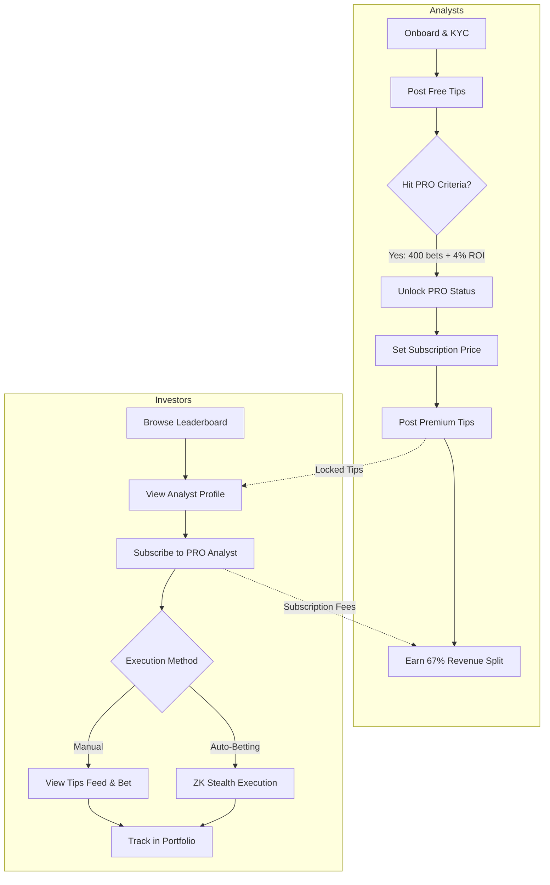
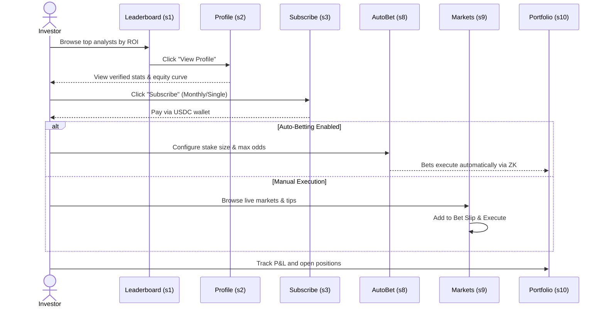
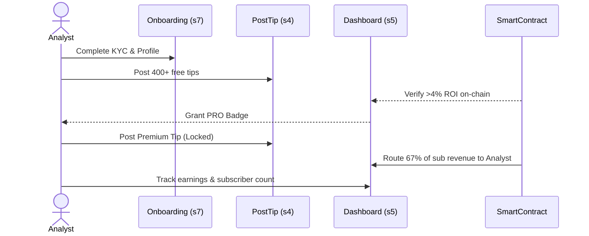

# Gainr Protocol — Tipster EPIC Wireframes

This repository contains the high-fidelity, interactive HTML wireframes for the **Gainr Tipster EPIC**. The design system is a 1:1 match with [gainr.pro](https://gainr.pro), utilizing the exact color palette, typography (Figtree), and component styling.

## 🚀 Live Preview
Deploy this repository to Vercel as a static site. The entire prototype is contained within `index.html`.

---

## 🗺️ System Architecture & User Flows

The Gainr Tipster EPIC serves two distinct user personas: **Analysts** (who post tips and earn revenue) and **Investors** (who subscribe to analysts and place bets).

### 1. High-Level Platform Flow



### 2. Investor Journey: Discovery to Execution



### 3. Analyst Journey: Onboarding to Revenue



---

## 📱 Screen Index (10 Screens)

The prototype contains 10 distinct screens, navigable via the top tab bar.

| ID | Screen Name | Description & Key Features |
|:---|:---|:---|
| **s1** | **Analyst Leaderboard** | Investor discovery hub. Features a top performers carousel, sortable table with live Chart.js sparklines, and $GAINR tier badges (Gold/Silver/Bronze). |
| **s2** | **Analyst Profile** | Public view of an analyst. Includes a stats grid (Bets, Profit, Yield, CLV), donut betting summary, equity curve, and a paywall for locked premium bets. |
| **s3** | **Subscribe Modal** | Checkout flow. Toggles between Monthly ($34.95) and Single Tip ($4.99), shows the 67/33 fee split, and includes an Auto-Betting upsell. |
| **s4** | **Post a Tip** | Analyst tool. Match browser with Pre-match/Live/Futures tabs, odds selection, bet slip with stake units, and a Free/Premium visibility toggle. |
| **s5** | **Analyst Dashboard** | Analyst private view. Revenue cards, subscriber counts, PRO status tracking, equity curve, and a table of recent tips with P&L. |
| **s6** | **Tips Feed** | Investor feed. Live stream of tip cards showing free tips, locked PRO tips, and tip distribution bars for featured matches. |
| **s7** | **Analyst Onboarding** | 5-step wizard explaining the path to PRO: Profile → KYC → Free Tips → PRO Qualification (400 bets, 4% ROI) → Earn. |
| **s8** | **Auto-Betting Setup** | Configuration for automated execution. Connects to Pinnacle/Betfair, sets capital/stake limits, and toggles ZK Stealth Execution. |
| **s9** | **Markets** | Kalshi-inspired sports prediction markets. Left sidebar for sport/type filtering, main feed of live market cards with probability bars, and a sticky bet slip. |
| **s10** | **Portfolio** | Investor tracking. KPI cards (Total Wagered, Net P&L), cumulative P&L chart, bet breakdown donut, open positions table, and bet history. |

---

## 🎨 Design System (CSS Variables)

The wireframe uses a single-file architecture with vanilla HTML/CSS/JS. All styling is driven by CSS custom properties extracted from `gainr.pro`.

```css
:root {
  --brand:           #FF5A00; /* Gainr Orange */
  --brand-hover:     #E64E00;
  --brand-light:     rgba(255,90,0,0.12);
  --black:           #1B0B0C;
  --dark-gray:       #333333;
  --gray:            #5B616E;
  --mid-gray:        #7A7F8C;
  --light-gray:      #EFEFF1;
  --border:          #E2E4EA;
  --white:           #FEFEFE;
  --bg:              #F6F8FC;
  
  /* Status Colors */
  --green:           #1F7A39; /* Won / Free */
  --red:             #D93025; /* Lost / Live */
  
  /* Typography */
  --font:            'Figtree', ui-sans-serif, system-ui, sans-serif;
}
```

### Key UI Components
1. **Glassmorphism Nav:** Uses `backdrop-filter: blur(24px)` with a semi-transparent gradient.
2. **Cards:** White background with a subtle shadow `0 2px 16px rgba(15,23,42,0.08)`.
3. **Badges:** Pill-shaped indicators for PRO (orange), FREE (green), and LIVE (red with pulse animation).
4. **Charts:** Rendered via `Chart.js` (v4.4.0) using the `initCharts()` function.

---

## 🛠️ Developer Notes

- **Single File:** The entire prototype is in `index.html`. Do not split into multiple files for this wireframe phase.
- **Screen Switching:** Handled by the `showScreen(id, btn)` JavaScript function at the bottom of the file. It toggles the `.active` class on the `.screen` divs.
- **Chart Initialization:** Charts are initialized only once per canvas ID to prevent memory leaks. They are triggered on load and after screen switches via `setTimeout(initCharts, 100)`.
- **Interactivity:** The Markets screen (s9) includes vanilla JS functions (`filterMarket`, `selectOdds`, `updateSlipCalc`) to demonstrate the bet slip logic and filtering without a framework.
