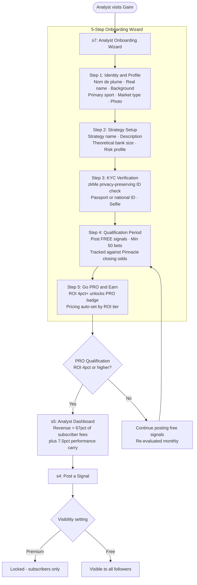
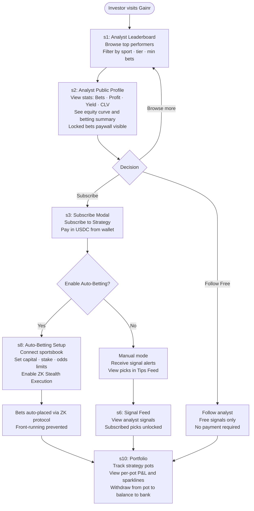
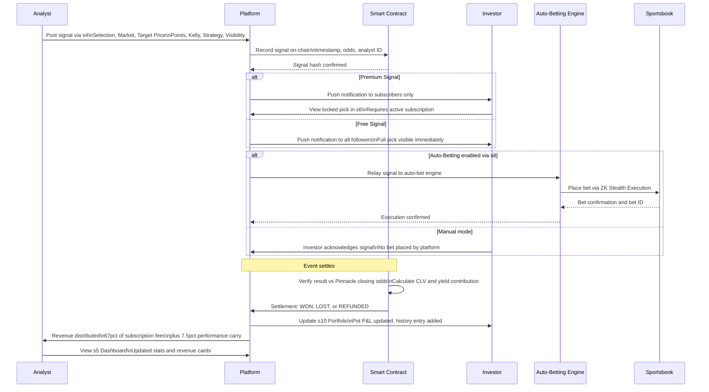
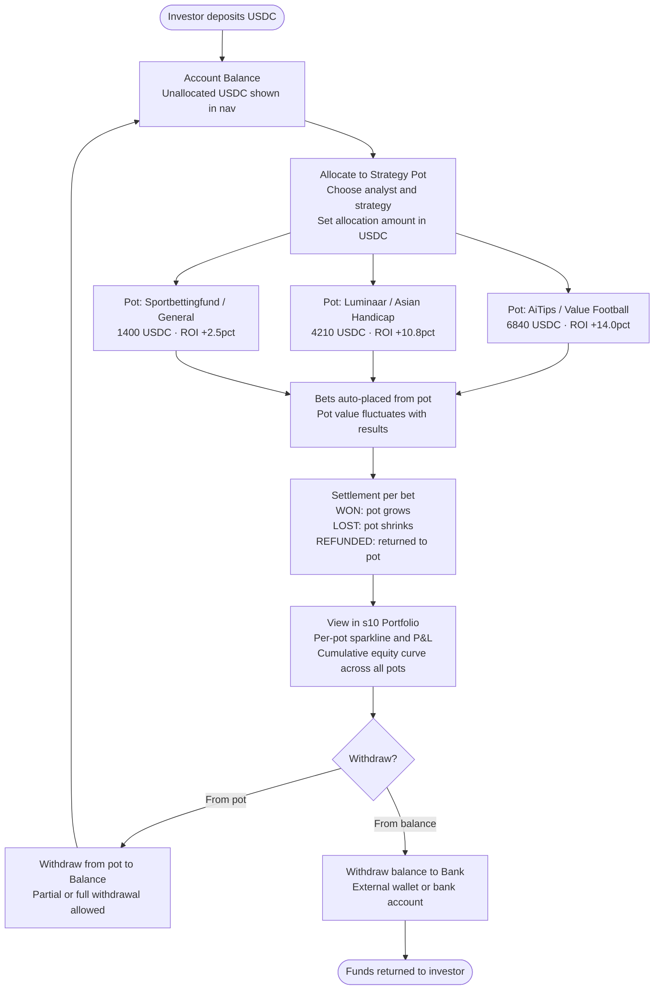
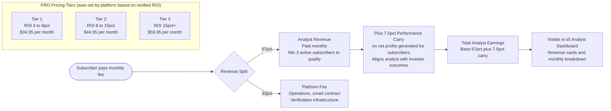

# Gainr Protocol — Tipster EPIC Wireframes

> **For developers.** Interactive HTML wireframe for the Gainr Tipster EPIC. 10 screens covering the full analyst and investor journeys. Matches the [gainr.pro](https://gainr.pro) design system exactly.

## Quick Start

```bash
git clone https://github.com/alanyoungcy/gainr_tips.git
cd gainr_tips
python3 -m http.server 8080
# Open http://localhost:8080
```

Deploy to Vercel: import `alanyoungcy/gainr_tips`, framework = **Other**, no build step.

---

## Screen Index

| # | Screen | Role | Key Features |
|---|--------|------|-------------|
| s1 | Analyst Leaderboard | Investor | Top performers carousel, sortable table, sparklines, $GAINR tier badges, sport/type/min-bets filters |
| s2 | Analyst Public Profile | Investor | Stats grid, donut betting summary, equity curve (5 tabs), locked bets paywall, Subscribe/Buy CTAs |
| s3 | Subscribe to Strategy Modal | Investor | Strategy subscription pricing, 67/33 fee split, USDC wallet, Auto-Betting upsell |
| s4 | Post a Signal | Analyst | Strategy selector, match browser, odds selection, target price, Kelly ratio, in-play trigger, Free/Premium toggle |
| s5 | Analyst Dashboard | Analyst | Revenue cards, equity curve, recent signals table, PRO status, Post New Signal CTA |
| s6 | Signal Feed | Investor | Live signal stream, locked/free/PRO-only states, sport/type filters |
| s7 | Analyst Onboarding | Analyst | 5-step wizard: Identity, Strategy, KYC, Qualification, PRO Earn |
| s8 | Auto-Betting Setup | Investor | Analyst selection, sportsbook connection, capital/stake params, ZK Stealth toggle |
| s9 | Markets | Investor | Sport categories, live market cards, no self-betting panel, analyst tip overlays |
| s10 | Portfolio | Investor | Strategy pots, pot P&L sparklines, cumulative equity curve, withdrawal flow, bet history |

---

## Access Control Rules

Two hard rules enforced across all screens:

1. **Individual picks are analyst-only.** Investors see aggregate stats and equity curves only. Actual selections (team, odds, stake) are always behind a subscribe paywall.
2. **No self-directed betting.** The platform is tips/signals only. Investors cannot place their own bets. The Markets screen shows odds for context only — no bet slip, no clickable odds.

---

## User Journey Flows

### Journey 1 — Analyst Onboarding and PRO Qualification

The analyst journey begins at the onboarding wizard (s7) and progresses through five sequential steps before the analyst can post premium signals and earn revenue.



**Key design decisions:**
- The nom de plume protects the analyst's IP while building a verifiable public track record.
- KYC uses zkMe's privacy-preserving protocol — identity is verified without storing raw documents.
- PRO status is evaluated monthly. If ROI drops below 4%, the analyst reverts to free-only posting.
- Pricing tiers are platform-set based on ROI, not analyst-set, to prevent manipulation.

---

### Journey 2 — Investor Discovery and Subscription

The investor journey starts at the leaderboard and flows through profile evaluation, subscription, and execution setup.



**Key design decisions:**
- Investors can follow for free (see free signals only) or subscribe (unlock premium picks).
- The profile page shows all aggregate stats publicly — only the individual picks are gated.
- Auto-Betting uses ZK Stealth Execution to prevent front-running by other market participants.

---

### Journey 3 — Signal Lifecycle (Analyst to Investor to Settlement)

This sequence diagram shows the full lifecycle of a single signal across all system participants.



---

### Journey 4 — Portfolio and Pot Management (Investor)

The portfolio is structured around strategy pots — each pot is tied to a specific analyst and strategy, allowing granular allocation and withdrawal.



**Key design decisions:**
- Each strategy pot is independent — an investor can withdraw from one pot without affecting others.
- Pot value is always denominated in USDC, not units, for clarity.
- The cumulative equity curve aggregates across all pots to show total portfolio performance.

---

### Journey 5 — Revenue and Pricing Model

Analyst pricing is platform-controlled and auto-set based on verified ROI tier. This prevents race-to-the-bottom pricing and aligns incentives.



**Key design decisions:**
- The 7.5% performance carry ensures analysts are incentivised to generate actual profits, not just volume.
- If an analyst's ROI drops below 4% in any rolling 30-day window, they revert to Tier 1 pricing automatically.
- Subscribers receive a pro-rated refund if their analyst's ROI drops below the minimum threshold mid-month.

---

## Design System

All CSS custom properties extracted from [gainr.pro](https://gainr.pro):

| Token | Value | Usage |
|-------|-------|-------|
| `--brand` | `#FF5A00` | Primary orange — CTAs, active states, highlights |
| `--brand-light` | `rgba(255,90,0,0.12)` | Orange tint — card backgrounds, badges |
| `--green` | `#1F7A39` | Positive P&L, win states, PRO badge, free badge |
| `--red` | `#D93025` | Negative P&L, loss states, live badge |
| `--dark` | `#1B0B0C` | Near-black — nav background |
| `--text` | `#1A1A1A` | Primary body text |
| `--mid-gray` | `#7A7F8C` | Secondary text, labels |
| `--border` | `#E2E4EA` | Card borders, dividers |
| `--font` | `Figtree` | All text — loaded from Google Fonts |
| `--radius-sm` | `8px` | Input fields, small cards |
| `--radius-md` | `12px` | Cards, modals |
| `--radius-lg` | `20px` | Large cards, containers |
| `--radius-pill` | `999px` | Buttons, badges, nav pills |

---

## Architecture Notes

**Single-file design.** `index.html` contains all HTML, CSS, and JS. No build step, no dependencies except Chart.js (CDN) and Figtree font (Google Fonts). This is intentional for the wireframe phase — it makes the file easy to share, review, and deploy.

**Screen switching.** `showScreen(id, btn)` hides all `.screen` divs and shows the target by toggling the `.active` class. The screen label at the top updates automatically. Charts are initialised lazily via `initCharts()` called on each screen switch with a 100ms debounce.

**Chart.js.** Sparklines (leaderboard table), equity curves (profile, dashboard, portfolio), donut charts (betting summary, portfolio breakdown), and pot sparklines (portfolio pots) all use Chart.js 4.4. Each canvas is guarded with `canvas._chartInit = true` to prevent double-initialisation on repeated screen switches.

**Analyst Onboarding Wizard.** `gotoStep(n)` controls the 5-step wizard by toggling `wpanel1`–`wpanel5` visibility and applying `active` or `completed` classes to `wstep1`–`wstep5` for the progress indicator.

**Markets interactivity.** `filterSport(sport)` filters market cards by sport category. All odds buttons are display-only — clicking them does nothing — to enforce the no-self-betting access control rule.

**Portfolio pots.** `initPotCharts()` renders sparklines for each strategy pot using Chart.js line charts with fill. Called automatically when the Portfolio screen (s10) is activated.
